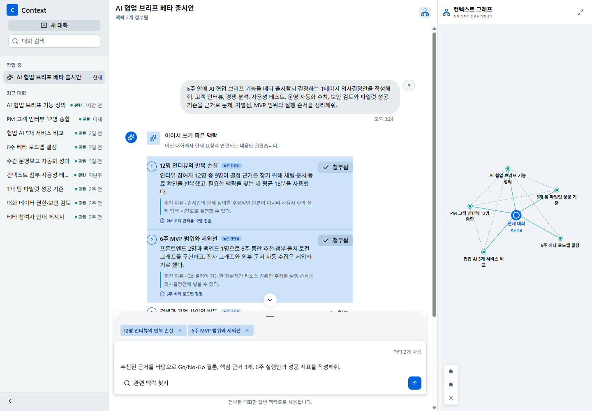

# Context Attach

현재 질문에 필요한 과거 LLM 대화를 찾아 선택적으로 첨부하고, 답변의 근거와 대화 간 관계를 함께 확인하는 채팅 프로토타입입니다.

**Live Demo:** [https://context-attach-hid.vercel.app/](https://context-attach-hid.vercel.app/)



## 프로젝트 배경

여러 프로젝트를 동시에 진행하는 PM과 기획자는 의사결정 근거가 여러 LLM 대화에 흩어진 상태에서 다음 문서를 작성해야 합니다. 새 대화를 시작할 때마다 과거 채팅을 검색하고 필요한 내용을 다시 설명하면 사고 흐름이 끊기고, 반대로 모든 기록을 자동으로 섞으면 어떤 정보가 답변에 사용됐는지 통제하기 어렵습니다. Context Attach는 현재 질문과 관련된 과거 대화를 추천하되, 사용자가 답변에 사용할 맥락을 직접 고르게 합니다. 목표는 맥락 회수에 드는 시간과 반복 설명을 줄이면서도 출처와 사용 범위를 명확하게 유지하는 것입니다.

## 핵심 흐름

1. 사용자가 새 대화에서 첫 질문을 보냅니다.
2. 시스템이 질문을 분석해 관련 과거 대화와 추천 이유를 제시합니다.
3. 사용자가 필요한 맥락만 명시적으로 첨부합니다.
4. 사용자가 후속 질문을 보내면 첨부된 맥락을 근거로 답변과 출처가 생성됩니다.
5. 오른쪽 컨텍스트 그래프에서 대화 간 관계를 확인하고 노드를 눌러 원문 대화로 이동합니다.

## 구현된 경험

- 새 대화, 대화 기록 검색, 과거 대화 열람을 하나의 작업공간에서 제공합니다.
- 첫 질문을 분석해 최대 3개의 맥락 카드를 추천하고, 각 추천에 출처와 연결 이유를 표시합니다.
- 추천 맥락은 첨부와 해제가 가능하며, 첨부된 항목만 후속 답변에 사용됩니다.
- 생성된 답변은 사용한 맥락을 출처 버튼으로 노출해 원문 대화로 돌아갈 수 있습니다.
- 컨텍스트 그래프는 현재 보고 있는 대화를 중심으로 최대 5개의 관련 대화를 다시 구성합니다.
- 새 대화에서 과거 대화를 열어도 작성 중인 문구, 첨부 맥락, 생성된 답변은 보존됩니다.
- 그래프 노드 선택, 확대·축소, 화면 확장, 모바일 오버레이 탐색을 지원합니다.
- React Flow 노드 크기와 그래프 모델을 안정화해 확대·축소 및 호버 중 연결선이 반복해서 재배치되지 않도록 했습니다.
- 데스크탑은 기록·채팅·그래프의 3영역 구조를 사용하고, 모바일은 기록과 그래프를 오버레이로 전환합니다.

## 데모 방법

1. 왼쪽 상단의 `새 대화`를 누릅니다.
2. 빈 화면에서 `예시 질문 넣기`를 누릅니다.
3. 아래 문구가 입력창에 채워진 것을 확인한 뒤 전송합니다.
4. 분석이 끝나면 새 대화를 중심으로 관련 과거 대화 5개가 그래프에 나타납니다.
5. 추천 카드에서 맥락을 첨부하고 후속 질문을 보내 답변과 출처를 확인합니다.
6. 그래프 노드를 눌러 관련 대화로 이동한 뒤 `현재 대화로 돌아가기`로 작업을 이어갑니다.

> AI 협업 브리프 기능의 베타 MVP 범위와 의사결정 기준을 정리해줘.

예시 버튼은 문구만 입력하며 자동으로 전송하지 않습니다. 사용자가 직접 전송하는 순간 그래프가 `연결 0개` 상태에서 관련 대화가 구성된 상태로 바뀌는 과정을 보여주기 위한 설계입니다.

## UX 원칙

- **명시적 통제:** 시스템은 관련 맥락을 제안하지만 답변에 사용할 맥락은 사용자가 결정합니다.
- **근거의 가시성:** 추천 이유, 첨부 상태, 답변 출처를 같은 흐름 안에서 확인할 수 있습니다.
- **현재 작업 중심:** 그래프는 고정된 전체 지식망이 아니라 지금 보고 있는 대화를 기준으로 재구성됩니다.
- **상태 보존:** 과거 대화를 탐색하는 동안 현재 대화의 작성 상태를 잃지 않습니다.
- **점진적 공개:** 채팅이 주 작업 공간이며 그래프는 관계를 확인하고 이동하는 보조 도구로 동작합니다.
- **접근성:** 아이콘 버튼에 접근 가능한 이름을 제공하고 키보드 포커스와 모바일 탐색 경로를 유지합니다.

## 디자인 시스템

UI 기반은 Astryx Neutral이며, Astryx의 reset, theme token, Button, Chat, Layout, Text, Token 컴포넌트를 사용합니다. 전체 색상은 약 1:2:7 비율로 강조색, 보조 상태색, 중립색을 배분해 채팅 내용을 우선하고 선택·연결 상태에만 색을 사용했습니다. 아이콘은 Lucide를 사용하며, 그래프는 React Flow와 d3-force를 결합했습니다.

```css
@import '@astryxdesign/core/reset.css';
@import '@astryxdesign/core/astryx.css';
@import '@astryxdesign/theme-neutral/theme.css';
```

## 기술 구성

- Next.js 16 정적 내보내기
- React 19와 TypeScript
- Astryx Design System Neutral Theme
- React Flow 기반 그래프 렌더링
- d3-force 기반 노드 배치
- Lucide React 아이콘
- Vitest 회귀 테스트
- Vercel 정적 배포

주요 데이터 흐름은 다음과 같습니다.

```text
contextData.ts (데모 대화와 맥락)
  -> context.ts (검색, 순위화, 그래프, 답변 생성)
  -> ContextWorkspace.tsx (대화와 탐색 상태)
  -> ConversationPanel / ContextGraphPanel / ConversationSidebar
```

## 로컬 실행

Next.js의 현재 요구사항에 맞는 Node.js 20.9 이상과 npm이 필요합니다.

```bash
npm ci
npm run dev
```

브라우저에서 [http://localhost:3000](http://localhost:3000)을 엽니다.

## 검증

```bash
npm test
npx tsc --noEmit
npm run build
```

테스트는 맥락 순위화, 추천 개수 제한, 첨부 상태, 답변 출처, 현재 대화 중심 그래프, 대화 이동 시 상태 보존, 데모 문구의 그래프 연결 수, 그래프 호버 안정성 회귀를 다룹니다. 상세 수용 시나리오는 [docs/atdd/context-attach-workspace.md](docs/atdd/context-attach-workspace.md)에 정리했습니다.

## 프로젝트 구조

```text
Phi_design_HID/
├─ public/                      # 정적 공개 파일
├─ src/app/                     # Next.js 진입점, 전역 스타일, UI 회귀 테스트
├─ src/components/workspace/    # 기록, 채팅, 추천, 그래프 UI
├─ src/data/                    # 데모 대화와 맥락 데이터
├─ src/lib/                     # 순위화, 그래프 구성, 답변 생성 로직과 테스트
├─ docs/atdd/                   # 사용자 흐름 수용 시나리오
├─ docs/submission/             # HID 제출용 요약
└─ ContextAttach_Final_1Pager.docx
```

## 프로토타입 범위

이 저장소는 UX 검증을 위한 프론트엔드 프로토타입입니다. 대화와 추천 결과는 로컬 데모 데이터로 동작하며 실제 LLM API, 사용자 인증, 서버 저장소, 권한 시스템은 연결되어 있지 않습니다. 실제 서비스로 전환하려면 대화 인덱싱, 권한 기반 검색, 임베딩 또는 하이브리드 검색, 모델 호출, 감사 로그와 데이터 보존 정책을 추가해야 합니다.

## 관련 문서

- [수용 시나리오](docs/atdd/context-attach-workspace.md)
- [HID 제출 요약](docs/submission/context-attach-hid-submission.md)
- [최종 1Pager](ContextAttach_Final_1Pager.docx)
